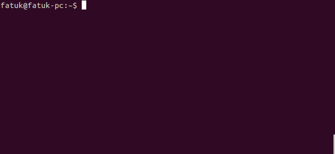

Небольшой обзор скрипта, который я собрал для себя, чтобы записывать короткие скринкасты в формате gif.

## Предисловие
Как-то понадобилось записать мои действия в консоли.
Нашелся консольный скринрекодер **byzans-record**. Качество записи меня устроило, но каждый раз указывать вручную область записи мне неподходило. Немного погуглив я нашел вариант скрипта, где была возможность указывать окно, а все параметры скрипт получал автоматически.

Представляю вашему вниманию мою сборку на основе [того](https://gist.github.com/lucy/3042755)скрипта.

## Установка:

Просто поместите файл скрипта `recrec` из [репозитория](https://github.com/fatuk/recrec) в папку `~/bin`. Теперь вы можете вызвать его из консоли `recrec`. Попробуйте написать `recrec --help`.

## Что скрипт умеет:

| параметр             | описание                                |
| :------------------- | :------                                 |
| `-h` or `--help`     | справка                                 |
| `-name`              | указать имя конечного файла             |
| `-ext`               | указать расширение (gif, flv, ogg, ogv) |
| `-del`               | указать задержку перед записью          |
| `-dur`               | указать длительность записи             |

А еще скрипт подает звуковой сигнал перед началом и завершением записи.

### Репозиторий:

[https://github.com/fatuk/recrec](https://github.com/fatuk/recrec)
